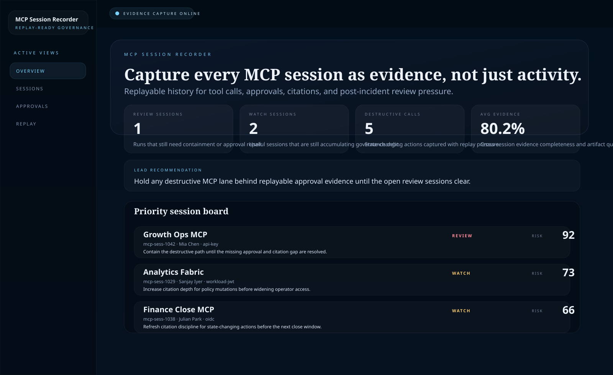
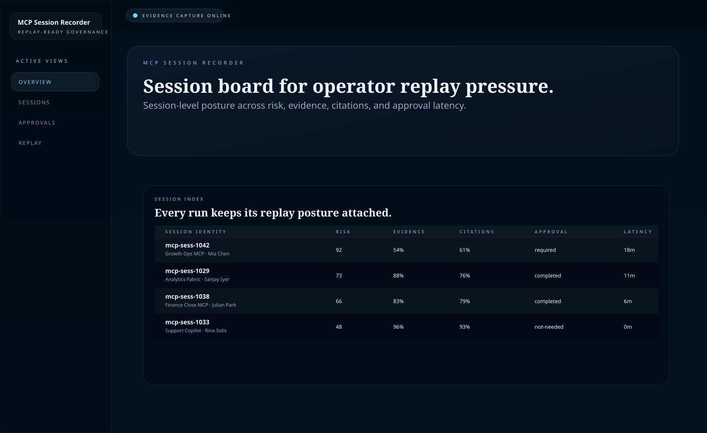
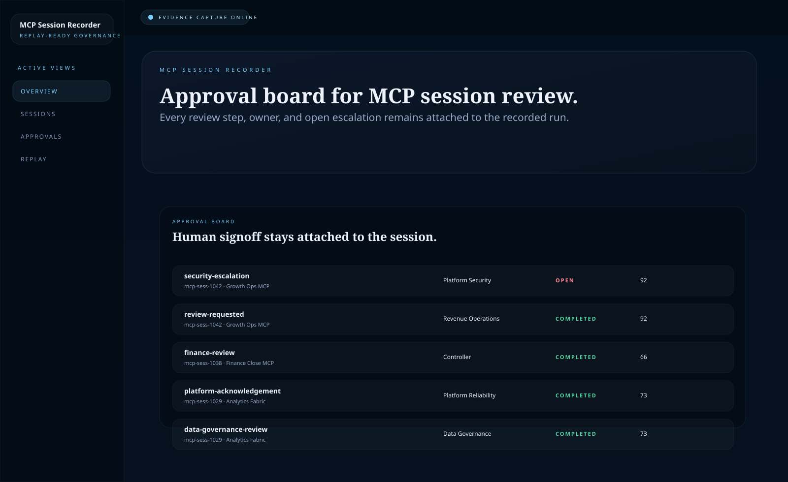

# MCP Session Recorder

Python and FastAPI recorder for **capturing MCP session replay, approval history, evidence chains, and operator-facing audit posture**.

> **What this repo proves**
>
> MCP governance is not only about policy before a tool runs. It is also about whether the session can be reconstructed later with enough approval, evidence, and citation history to survive a hard review.

## Why this repo exists

Teams can usually tell you that an MCP tool ran.

They struggle much more with the harder questions:

- who approved the destructive path
- which evidence artifacts were retained
- whether the output stayed grounded in cited context
- which sessions should be replayed first during incident review
- where review pressure is building before a control failure becomes public

`mcp-session-recorder` models that layer directly. It treats each MCP run like an operator event with replay posture, approval chain, and evidence coverage attached.

## Screenshots






## What it includes

- FastAPI service with HTML proof surfaces and JSON APIs
- sample MCP session inventory across revenue, finance, support, and analytics lanes
- session ranking for replay priority, approval pressure, and destructive exposure
- approval board for review ownership and escalation state
- recollection API for pulling the most relevant prior sessions back into operator context
- SVG proof assets generated from the same service state
- unit tests, smoke checks, and GitHub Actions CI

## Local run

```powershell
Set-Location "C:\Users\chaus\dev\repos\mcp-session-recorder"
py -3.11 -m venv .venv
.\.venv\Scripts\pip.exe install -r requirements.txt
.\.venv\Scripts\python.exe -m app.main
```

Open:

- [http://127.0.0.1:5018/](http://127.0.0.1:5018/)
- [http://127.0.0.1:5018/sessions](http://127.0.0.1:5018/sessions)
- [http://127.0.0.1:5018/approvals](http://127.0.0.1:5018/approvals)
- [http://127.0.0.1:5018/replay](http://127.0.0.1:5018/replay)
- [http://127.0.0.1:5018/docs](http://127.0.0.1:5018/docs)

If the port is busy:

```powershell
$env:PORT = "5022"
.\.venv\Scripts\python.exe -m app.main
```

## Validation

```powershell
.\.venv\Scripts\python.exe -m unittest discover -s tests
.\.venv\Scripts\python.exe scripts\run_demo.py
.\.venv\Scripts\python.exe scripts\smoke_check.py
.\.venv\Scripts\python.exe scripts\render_readme_assets.py
```

## API routes

- `GET /api/dashboard/summary`
- `GET /api/sessions`
- `GET /api/sessions/{session_id}`
- `GET /api/approvals`
- `GET /api/replay`
- `GET /api/sample`
- `POST /api/recollect`

## Repo layout

```text
app/
  data/
  services/
docs/
scripts/
screenshots/
tests/
```
